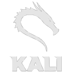
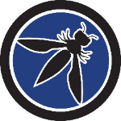
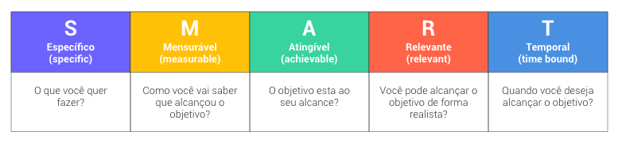

# 🔖 **SUMÁRIO**

Nesta página encontra-se 3 Tópicos Principais, são estes:

+ **[Segurança em Aplicações WEB](#segurança-em-aplicações-web);**
+ **[Métodos Ágeis de A a Z](#métodos-ágeis-de-a-a-z);**
+ **[Certificação](#certificação-📝).**

---

&nbsp;

# Segurança em Aplicações WEB

Abaixo vemos as principais vulnerabilidades em aplicações WEB, temos:

1. **Injeção:** dados não confiáveis são enviados à uma aplicação, onde o "usuario" terá acesso aos dados do servidor;
2. **Autentificação:** funções de autentificação implementadas incorretamente (token, senhas, chaves);
3. **Exposição:** Quando um usuário não projete seus dados, expondo para outros usuários;
4. **XML (linguagem que permite armazenar darks, de 1 forma compartilhavel):** usuário acessa seu XML, tendo acesso à todos os arquivos guardados;
5. **Acesso ao Sistema:** quando não há controle de acesso, qualquer individuo tem permissão para entrar no sistema;
6. **Configurações Incorretas:** configurações padrões não alteradas;
7. **XSS Scripts:** Vulnerabilidade de segurança comum encontrada em aplicativos da web. Essa vulnerabilidade permite que um invasor insira scripts maliciosos (código) em páginas da web acessadas por outros usuários. 
8. **Desserialização:** Uma falha de segurança que ocorre quando um programa ou aplicativo desserializa dados de uma fonte não confiável sem realizar as devidas verificações e validações;
9. **Componentes Vulneraveis;**
10. **Registro de Monitoramento Insuficiente;**

&nbsp;

## **1. Laboratório:**

Para aulas práticas, utilizaremos: 
+ Kali Linux;
+ OWASP.

&nbsp;

## **2. Fases da Análise de Vulnerabilidade:**

+ **Reconhecimento (Footprint):** Aqui conhecemos o ambiente e coletamos dados;
+ **Varredura (Scanning):** Vamos escanear toda a estrutura a procura de vulnerabilidades, esta pode ser feita manualmente ou com o auxílio de uma máquina;
+ **Exploração (gaining Acess):** "partimos para o ataque", exploramos as vulnerabilidades;
+ **Escalação de Privilegios (Maintaining Acces):** Momento onde conseguimos acesso ao sistema.

&nbsp;

## **3. Metodologia:**

+ **OSSTMN (Open Source Security Testing Methodology Manual);** 
+ **ISSAF(Information Systems Security Assessment Framework);** 
+ **WASC-TC;** 
+ **OWASP.** 

&nbsp;

# Métodos Ágeis de A a Z

+ **Scrum:** Projetado para ajudar equipes a trabalharem em colaboração, de maneira integrativa, com o objetivo de entregar produtos de alta qualidade em um ambiente complexo e em constante mudança. Este possui três pilares, são estes:
  + **Transparência:** Todas as informações para a construção do produto estejam disponíveis para todos os integrantes;
  + **Inspeção:** Inspeções frequentes no produto em si e no processo de trabalho;
  + **Adaptação:** Alinhamento de plano de ação para resolver oportunidades ou necessidades.
+ **Kanban:** Método utiliza cartões ou notas adesivas como representações visuais das tarefas a serem realizadas, onde uma das ferramentas utilizadas para seu aprendizado foi o Trello;
+ **Lean:** O Lean se baseia em princípios e práticas que visam reduzir a quantidade de recursos (tempo, esforço, dinheiro, etc.);
+ **SMART:** Técnica para se definir objetivos, onde suas siglas significam:
    + **Específico (Specific):** O objetivo deve ser claro e específico;
    + **Mensurável (Measurable):** O objetivo deve ser mensurável, permitindo que o progresso e o sucesso sejam quantificados;
    + **Alcançável (Attainable):** O objetivo deve ser desafiador, mas ao mesmo tempo realista e alcançável com base nos recursos;
    + **Relevante (Relevant):** O objetivo deve estar alinhado com os objetivos gerais do projeto;
    + **Temporizável ou com Tempo Definido (Time-bound):** O objetivo deve ter um prazo definido para sua conclusão.

&nbsp;

&nbsp;

# 📝 Certificação

+ Certificado de conclusão do curso "Segurança em Aplicações WEB" de 07h32m;
  

+ Certificado de conclusão do curso "Métodos Ágeis de A a Z: o Curso Completo" de 09h37m;
  

---