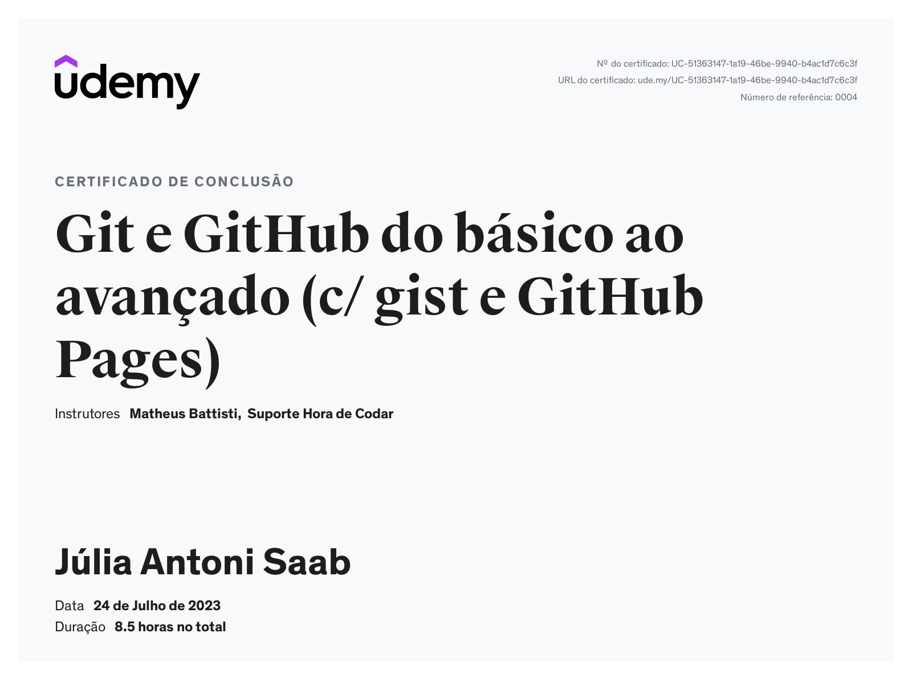

# 🔖 **SUMÁRIO**

Nesta página encontra-se 3 Tópicos Principais, são estes:

+ **[Git e GitHub do Básico ao Avançado](#git-e-github-do-básico-ao-avançado);**
+ **[Linux Para Desenvolvedores](#linux-para-desenvolvedores);**
+ **[Certificação](#📝-certificação).**

---

&nbsp;

# Git e GitHub do Básico ao Avançado

## **1. Repositório**

Um repositório é o local onde armazenammos o código dos nossos projetos, podendo ele ser um **Repositório Local**, isto é, os dados ficam localizados no computador, ou também encontramos o **Repositório Remoto**, onde se armazena os dados em um servidor, permitindo que outro desenvolvedores consultem.

&nbsp;

---

## **2. GIT**

Inicialmente, devemos compreender o que é esta ferramenta, Git é um sistema de controle de versões distribuído, nele utilizamos tais comandos:

+ **Git Init:** Criar um novo repositorio do Git;

+ **Git Status:** Exibe as condições do diretório de trabalho e da área do staging;

+ **Git Add:** Serve para induir as alterances de um ou vários arquivos próximo commit; 
    + **_git add < arquivo >_**: Utilizado para adicionar arquivos em específico utilizamos;
    + **_git add -A_**: Aplicamos este em casos de preferir adicionar tudo ao mesmo tempo;

+ **Git Commit:** este adiciona alterações recentes do código fonte, tornando as alterações parte da revisão do repositório.
  +  **_git commit -m "mensagem"_**: Utilizamos este comando para salvar alterações no arquivo e juntamente enviarmos uma mensagem.

+ **Git Branch:** podemos compreender como "ramificação", onde desenvolvedores trabalham em paralelo de maneira simultânea;

+ **Git Push:** Utilizado para enviar as alterações ao servidor remoto ([GITHUB](https://github.com/)), ou seja, é uma ferramenta de Upload;
  + VSCODE → GITHUB;

+ **Git Pull:** Busca por atualizações do conteúdo, sincronizando do repositório remoto ([GITHUB](https://github.com/)) para o repositório local (VSCODE).
  + GITHUB → VSCODE;

---

## **3. Markdown**

O Markdown é considerado uma linguagem de marcação, com o objetivo de formatar arquivos e editar textos.
Alguns comandos são:

+ **Cerquilha ( # ):** Utilizado para criar títulos, onde quanto maior o número de cerquilhos, menor será o tamanho do título;

+ **Asterisco ( * ):** Utilizado ao redor de uma palavra para aplicar o texto em negrito;

+ **Underline ( _ ):** Utilizado ao redor de uma palavra para aplicar o texto em sublinhado;

+ **Colchetes e Parênteses ( [] & () ):** Utilizados para fazer um texto-âncora, ou seja, aplicar um endereço de destino ao texto selecionado;

+ **Soma ( + ):** Utilizamos para fazer um lista básica;

+ **Numeração ( 1.; 2.; 3.; etc ):** Utilizamos para fazer uma lista enumerada;

&nbsp;

---

&nbsp;

# Linux Para Desenvolvedores

## **1. Linux**

O Linux é um sistema operacional de código aberto, muito conhecido por sua estabilidade e segurança. Para que possamos utilizar e aproveitar esta ferramenta, acessamos o Terminal, este é uma interface de linha de comando, que permite aos usuários interagirem com o sistema operacional. 

---

## **2. O que é o comando "SUDO"?**

O comando "sudo" possui como função implementar determinadas permições à usuários, controlando acessos e atividades. Para realizar algumas atividades devemos aprender alguns comandos, estes são:

+ **"ls":** Lista os arquivos e diretórios no diretório atual;
  
+ **"cd":** Navega entre diretórios;

+ **"clear":** Utilizado para limpar a tela do terminal;

+ **"cat":** Usado para exibir o conteúdo de um ou mais arquivos de texto;

+ **"touch":** Utilizado para criar um novo arquivo vazio ou atualizar o carimbo de data e hora de um arquivo existente;

+ **"man":** Ferramenta que permite acessar o manual de referência (manpages) do sistema operacional;

+ **"mkdir":** Cria um novo diretório;

+ **"rm":** Remove arquivos ou diretórios;

+ **"rmdir":** Remove um diretório vazio;

+ **"cp":** Copia arquivos ou diretórios;

+ **"mv":** Move ou renomeia arquivos ou diretórios;

+ **"pwd":** Mostra o diretório atual em que você está;

+ **"head":** Utilizado para exibir as primeiras linhas de um arquivo de texto;

+ **"tail":** Utilizado para exibir as últimas linhas de um arquivo de texto;

+ **"grep":** Ferramenta de busca de texto que permite aos usuários localizarem padrões específicos em arquivos ou na saída de outros comandos;

+ **"find":** Ferramenta de busca que permite localizar arquivos e diretórios com base em critérios específicos, como nome, tipo, tamanho, data de modificação, etc;

+ **"locate":** Usado para localizar arquivos e diretórios em todo o sistema de arquivos de forma rápida e eficiente.

&nbsp;

---

## **3. Editores de Texto**

+ **"nano":** Editor de texto de linha de comando, projetado para ser simples e fácil de usar, especialmente para iniciantes;

+ **"vim":** Assim como o "nano", este também é considerado um editor de texto de linha de comando, onde sua diferença é a metodologia, que demonstra ser um pouco mais avançada, recomendada para profissionais.

---

## **4. Gerenciamento Básico de Redes**

+ **"DNS":**  Responsável por converter esse nome de domínio em um endereço IP, que é o endereço numérico único associado ao servidor ou dispositivo na internet;

+ **"TPS":** Protocolo orientado à conexão e fornece a comunicação confiável com diversas ferramentas;

+ **"UDP":** Protocolo de transporte em tempo real sem conexão, processo de comunicação mais agilizado;

&nbsp;

# 📝 Certificação

+ Certificado de conclusão do curso "Git e GitHub do básico ao avançado (c/ gist e GitHub Pages)" de 07h22m;

+ Certificado de conclusão do curso 
"Linux para Desenvolvedores (c/ terminal, Shell, Apache e +)" de 6h19m;

---